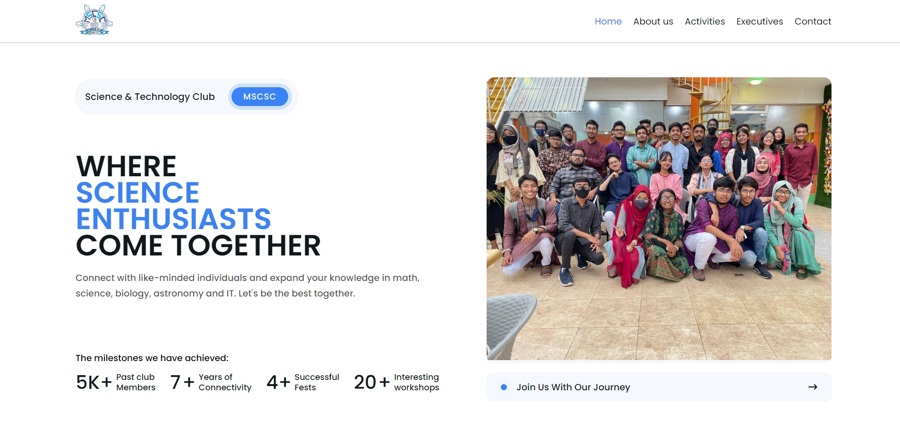

# MSCSC - Official Website
#### MSCSC - Monipur High School Science Club

### Link: https://rakesh-karmaker.github.io/mscsc
Welcome to MSCSC’s official website repository. This platform highlights our club’s events, departments, and activities while showcasing the development journey of our official site. Members who wish to contribute can connect with our team to share their ideas and actively participate in building and improving this repository.

## Tech Stack

- [HTML](https://developer.mozilla.org/en-US/docs/Web/HTML) - Markup Language
- [Vanilla CSS](https://developer.mozilla.org/en-US/docs/Web/CSS) – CSS
- [JavaScript](https://developer.mozilla.org/en-US/docs/Web/JavaScript) – Language
- [Github](https://pages.github.com/) – Hosting

## Any Issues?

Please contact to mscscofficial17@gmail.com or open an issue if you find any bugs and issues. We would be very grateful to you.

## Contact Us

- [Website](https://rakesh-karmaker.github.io/mscsc)
- [Facebook](https://www.facebook.com/MSCSC2014)
- [Instragram](https://www.instagram.com/_mscsclub_)
