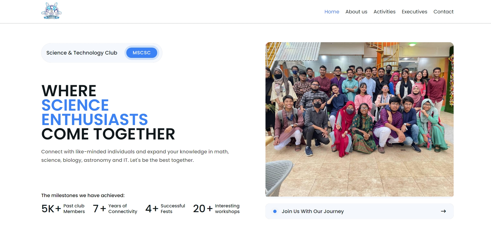

# MSCSC - Official Website

#### MSCSC - Monipur School & College Science Club



### Link: https://mscsc.netlify.app/

Welcome to MSCSC’s official website repository. This platform highlights our club’s events, departments, and activities while showcasing the development journey of our official site. Members who wish to contribute can connect with our team to share their ideas and actively participate in building and improving this repository.

## Tech Stack

|  Front-End   |     |   Back-End   |     | Hosting |
| :----------: | --- | :----------: | --- | :-----: |
| Typescript 5 |     | Typescript 5 |     | Netlify |
| React.js 19  |     |   Express    |     | Render  |
|     CSS      |     |   MongoDB    |     |         |

## Project Structure

```bash
mscsc-main-website/
│
├── client/ # Frontend (React, TypeScript)
│ ├── src/
│ │ ├── components/ # Reusable UI components
│ │ ├── layouts/ # Page layouts and navigation
│ │ ├── pages/ # Page components (routed)
│ │ ├── hooks/ # Custom React hooks
│ │ ├── contexts/ # React context providers
│ │ ├── router/ # Route definitions
│ │ ├── services/ # data services
│ │ ├── lib/ # API client and other libraries
│ │ ├── types/ # TypeScript types/interfaces
│ │ └── utils/ # Utility/helper functions
│ └── public/ # Static assets
│
├── server/ # Backend (Express, TypeScript)
│ ├── src/
│ │ ├── modules/ # Feature-based backend modules
│ │ │ ├── activities/ # Activities logic (controller, model, schema, types, router)
│ │ │ ├── admin/ # Admin/dashboard logic (controller, router)
│ │ │ ├── auth/ # Authentication (controller, schema, types, router)
│ │ │ ├── events/ # Events and event registration (controllers, models, routers, schemas, types)
│ │ │ ├── forgot-password/ # Password reset logic (controller, model, router, types, utils)
│ │ │ ├── members/ # Member management (controller, types, router)
│ │ │ ├── messages/ # Message/contact logic (model, schema, types, controller, router)
│ │ │ └── tasks/ # Task management (model, queries, schema, types, controllers, router, utils)
│ │ ├── shared/ # Shared utilities, middlewares, config, and base models
│ │ │ ├── config/ # App configuration and image storage
│ │ │ ├── lib/ # File upload, mail, pagination helpers
│ │ │ ├── middlewares/ # Express middlewares (auth, error, multer)
│ │ │ ├── models/ # Shared Mongoose models
│ │ │ └── utils/ # General-purpose utilities (slug, hash, date, etc.)
│ │ ├── app.ts # Express app setup
│ │ └── server.ts # Server entry point
│ └── ...
│
└── README.md # Project documentation (this file)
```

## Folder Overview

- client/: Frontend React app (components, pages, layouts, hooks, etc.)
- server/src/modules/: Each folder is a backend feature module (e.g., members, tasks, events), containing its own - controller, model, types, router, and related logic.
- server/src/shared/: Shared code across modules (middlewares, config, utilities, base models).
- public/: Static assets (images, fonts, etc.)

## Features

- **Modern Modular Architecture**  
  Organized codebase with feature-based modules for easy scalability and maintenance.

- **Full-Stack TypeScript**  
  Both frontend and backend are written in TypeScript for type safety and developer productivity.

- **Frontend (React)**
  - Responsive UI with reusable components and layouts
  - Context and hooks for state management
  - Modular routing and page structure
  - Custom forms, dashboards, and admin panels

- **Backend (Express)**
  - RESTful API with modular routes and controllers
  - Authentication and authorization (JWT-based)
  - Member, event, activity, message, and task management
  - File uploads, pagination, and validation utilities
  - Admin dashboard with statistics and analytics

- **Database**
  - MongoDB with Mongoose models for all resources
  - Aggregation and advanced querying for analytics

- **Utilities & Shared Code**
  - Centralized configuration, middlewares, and helpers
  - Shared types and validation schemas

- **Deployment Ready**
  - Easily deployable to Netlify (frontend) and Render (backend)
  - Environment-based configuration for production and development

## Contributions

### Supervision and Guidelines

- Alvi Abid - President (2024-2025) - Batch 2025

### Full Stack Web Developer

- Rakesh Karmaker - Head of IT Dpt. - Batch 2026

## Any Issues?

Please contact to [mscscofficial17@gmail.com](mailto:mscscofficial17@gmail.com) or open an issue if you find any bugs and issues. We would be very grateful to you.

## Contact Us

- [Website](https://mscsc.netlify.app/)
- [Facebook](https://www.facebook.com/MSCSC2014)
- [Instagram](https://www.instagram.com/_mscsclub_)
